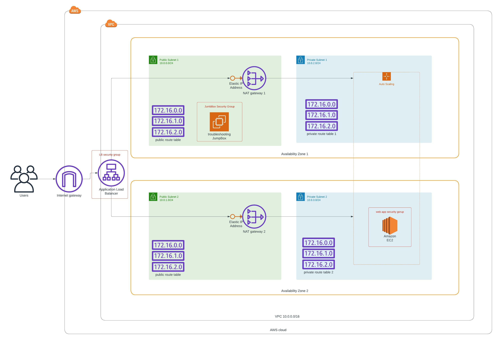

## project 2 - Deploy a high-availability web app using CloudFormation
This is my second project in **Advanced Cloud DevOps Nanodegree Program** from udacity
> Creating this project will give you the hands-on experience you need to confidently talk about infrastructure as code. We have chosen a realistic scenario where you will deploy a dummy applicationto the Apache Web Server running on an EC2 instance

> **Scenario**<br>
Your company is creating an Instagram clone called Udagram.<br>
Developers want to deploy a new application to the AWS infrastructure.<br>
You have been tasked with provisioning the required infrastructure and deploying a dummy application, along with the necessary supporting software.
This needs to be automated so that the infrastructure can be discarded as soon as the testing team finishes their tests and gathers their results.

## Folder Content
1. `Screen Shoots/` : some of screen shoots show that inferstructure up and running
2. `Diagrams/`      : Diagram of infrastructure architecture
3. `UdagramNetwork.yml`: CloudFormation Template file to provision Network components
4. `UdagramServer.yml` : CloudFormation Template file to provision Servers components
5. `create.bat` : Batch script wich will Create cloudformation stack in `us-west-2` Region 
6. `update.bat` : Batch script wich will Update cloudformation stack in `us-west-2` Region

## Doplayment Instructions:
1. Manually create and download keypair called `private-ec2-devops` All generated ec2 will use this key to communicate through ssh For debugging purposes
2. create Required Network infrastructure (i.e VPC, Subnets, Getway , Elastic IPs and Route tables),after run the following command go to cloudformation service in aws console and make sure that there is stack called `UdagramNetwork` created successfully
   ```
   create.bat UdagramNetwork UdagramNetwork.yml UdagramNetworkParameters.json
   ```
3. create Required Servers infrastructure ( autoscalling group , Security gruoups , load balancers)
   ```
   create.bat UdagramServers UdagramServer.yml UdagramServerParameters.json
   ```

## Architecture Diagram

